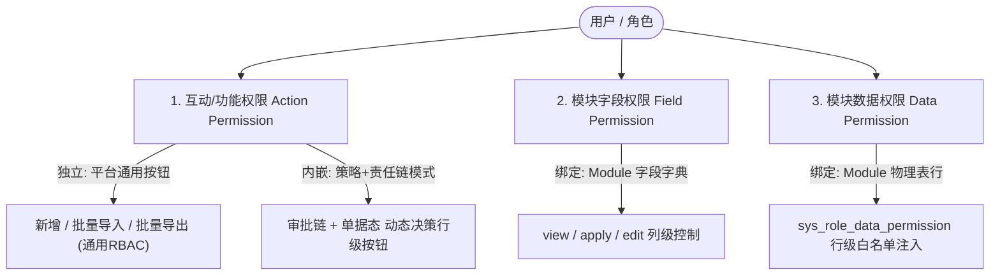
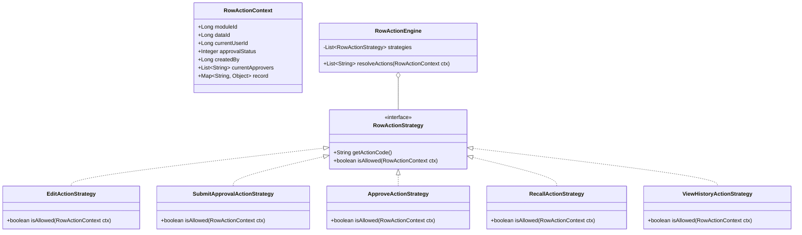
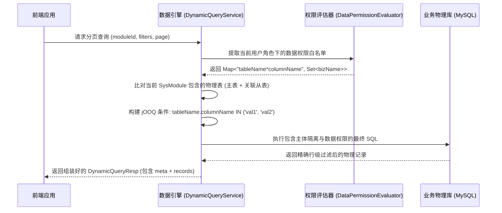

# JDEC 数据引擎权限体系设计方案

## 1. 概述与核心理念

在 JDEC 低代码平台中，权限体系遵循“三权分立与多维隔离”原则，从不同层次保证系统安全与操作灵活性：

1. **菜单权限（Menu Permission）**：页面路由访问控制。
2. **字段权限（Field Permission）**：**列级（Column-Level）** 控制，基于 `view / apply / edit`（查阅/申请/变更）精确控制动态表单与列表各字段的显隐与只读态。
3. **数据权限（Data Permission）**：**行级（Row-Level）** 控制，基于物理表字段离散白名单（`tableName*columnName`）实现数据行级过滤与主体隔离。
4. **互动/功能权限（Action Permission）**：**操作级（Action-Level）** 控制，分流为“全局操作”与“单据行级操作”。其中行级操作由**“审批链（Approval Chain）+ 单据当前态（Document State）”**共同裁决。



---

## 2. 互动权限设计模式：策略模式 + 责任链模式 (Strategy & Chain of Responsibility)

### 2.1 决策模型分析

单据的行级按钮（如“编辑”、“提交审批”、“审批通过”、“驳回”、“撤回”、“查看版本”）绝对不能硬编码，它是由两个维度的上下文联合计算决定的：
1. **单据维度（Document Context）**：单据当前审批状态（`draft / pending / approved / rejected`）、创建人（`created_by`）、所属主体等；
2. **审批链维度（Approval Chain Context）**：当前登录用户在当前审批节点是否为“当前审批人（Approver）”、是否为“提单人（Submitter）”、是否具备特定审核角色（Auditor）。

### 2.2 设计模式选型

采用 **“策略模式（Strategy Pattern）+ 规则责任链（Chain of Responsibility）”**：
- **`RowActionStrategy`（动作策略接口）**：每个具体动作（如 `EditActionStrategy`、`ApproveActionStrategy`、`RecallActionStrategy`）独立封装判定逻辑，符合开闭原则（OCP）；
- **`RowActionEngine`（动作裁决引擎）**：聚合所有已注册策略，并行或链式求值，输出当前单据允许的动作集合 `Set<String>`。



---

### 2.3 伪代码实现

#### 1) 动作上下文对象 (`RowActionContext`)
```java
@Data
@Builder
public class RowActionContext {
    private Long moduleId;
    private Long dataId;
    private Long currentUserId;
    private List<Long> currentUserRoleIds;
    
    // 单据当前状态
    private Integer approvalStatus; // 0-草稿, 1-审批中, 99-审批通过生效, -99-已驳回/作废
    private Long createdBy;
    
    // 审批链上下文
    private Long currentNodeId;              // 当前审批节点ID
    private List<Long> currentApproverUserIds;// 当前节点审批人ID列表
    private List<Long> currentApproverRoleIds;// 当前节点审批角色ID列表
    
    private Map<String, Object> rawRecord;   // 单据原始数据
}
```

#### 2) 动作策略接口与具体实现 (`RowActionStrategy`)
```java
public interface RowActionStrategy {
    /** 动作编码 (对应前端操作按钮唯一标识) */
    String getActionCode();

    /** 结合单据态与审批链上下文判定是否允许执行 */
    boolean isAllowed(RowActionContext ctx);
}

/** 1. 编辑策略: 草稿态/驳回态且为提单人，或特定管理员 */
@Component
public class EditActionStrategy implements RowActionStrategy {
    @Override
    public String getActionCode() { return "EDIT"; }

    @Override
    public boolean isAllowed(RowActionContext ctx) {
        // 审批通过归档后(99)或审批中(1)，严禁直接编辑
        if (ctx.getApprovalStatus() == 99 || ctx.getApprovalStatus() == 1) {
            return false;
        }
        // 仅创建人本人在草稿(0)或驳回(-99)时可编辑
        return Objects.equals(ctx.getCurrentUserId(), ctx.getCreatedBy());
    }
}

/** 2. 提交审批策略: 草稿/驳回态且为提单人可提审 */
@Component
public class SubmitApprovalActionStrategy implements RowActionStrategy {
    @Override
    public String getActionCode() { return "SUBMIT_APPROVAL"; }

    @Override
    public boolean isAllowed(RowActionContext ctx) {
        return (ctx.getApprovalStatus() == 0 || ctx.getApprovalStatus() == -99)
                && Objects.equals(ctx.getCurrentUserId(), ctx.getCreatedBy());
    }
}

/** 3. 审批/审核策略: 单据审批中(1)且当前登录人在当前审批链节点列表内 */
@Component
public class ApproveActionStrategy implements RowActionStrategy {
    @Override
    public String getActionCode() { return "APPROVE"; }

    @Override
    public boolean isAllowed(RowActionContext ctx) {
        if (ctx.getApprovalStatus() != 1) {
            return false;
        }
        // 校验当前用户是否为该节点审批人或具备审批角色
        boolean isUserMatch = ctx.getCurrentApproverUserIds() != null 
                && ctx.getCurrentApproverUserIds().contains(ctx.getCurrentUserId());
        boolean isRoleMatch = ctx.getCurrentApproverRoleIds() != null 
                && ctx.getCurrentApproverRoleIds().stream().anyMatch(ctx.getCurrentUserRoleIds()::contains);
        
        return isUserMatch || isRoleMatch;
    }
}

/** 4. 撤回策略: 审批中(1)且仅提单人可撤回 */
@Component
public class RecallActionStrategy implements RowActionStrategy {
    @Override
    public String getActionCode() { return "RECALL"; }

    @Override
    public boolean isAllowed(RowActionContext ctx) {
        return ctx.getApprovalStatus() == 1 
                && Objects.equals(ctx.getCurrentUserId(), ctx.getCreatedBy());
    }
}

/** 5. 查看版本与快照对比策略: 全流程均可看 */
@Component
public class ViewHistoryActionStrategy implements RowActionStrategy {
    @Override
    public String getActionCode() { return "VIEW_HISTORY"; }

    @Override
    public boolean isAllowed(RowActionContext ctx) {
        return true; // 具备读权限即可看版本
    }
}
```

#### 3) 动作裁决引擎 (`RowActionEngine`)
```java
@Service
@RequiredArgsConstructor
public class RowActionEngine {

    private final List<RowActionStrategy> strategies;
    private final ApprovalChainService approvalChainService; // 审批链服务

    /** 批量解析列表多行记录的可用动作 */
    public void populateRowActions(Long moduleId, List<Map<String, Object>> records, Long currentUserId, List<Long> userRoleIds) {
        if (records == null || records.isEmpty()) return;

        // 1. 批量预加载当前页所有单据的审批链上下文 (避免循环查库 N+1)
        List<Long> dataIds = extractDataIds(records);
        Map<Long, ApprovalChainInfo> approvalInfoMap = approvalChainService.getBatchApprovalInfo(moduleId, dataIds);

        // 2. 逐行计算允许的 actions
        for (Map<String, Object> record : records) {
            Long dataId = extractId(record);
            ApprovalChainInfo appInfo = approvalInfoMap.get(dataId);

            RowActionContext ctx = RowActionContext.builder()
                    .moduleId(moduleId)
                    .dataId(dataId)
                    .currentUserId(currentUserId)
                    .currentUserRoleIds(userRoleIds)
                    .approvalStatus(extractStatus(record))
                    .createdBy(extractCreatedBy(record))
                    .currentNodeId(appInfo != null ? appInfo.getCurrentNodeId() : null)
                    .currentApproverUserIds(appInfo != null ? appInfo.getApproverUserIds() : Collections.emptyList())
                    .currentApproverRoleIds(appInfo != null ? appInfo.getApproverRoleIds() : Collections.emptyList())
                    .rawRecord(record)
                    .build();

            List<String> allowedActions = strategies.stream()
                    .filter(s -> s.isAllowed(ctx))
                    .map(RowActionStrategy::getActionCode)
                    .toList();

            // 写入当前行记录中
            record.put("_actions", allowedActions);
        }
    }
}
```

---

## 3. 数据权限（Data Permission）架构与程序落地

### 3.1 数据库元模型

配置中心（`config_center`）通过以下两张表管理数据权限节点及角色授权：

- **`sys_data_permission`（数据权限节点定义表）**：
  - `code`：规则编码，标准格式为 **`tableName*columnName`**（如 `student*student_no`、`class*class_name`、`student*gender`）；
  - `name`：权限节点显示名称（如“学号”、“班级名称”）；
  - `project_no` & `subject_id`：所属应用与主体。
- **`sys_role_data_permission`（角色-数据权限白名单关联表）**：
  - `role_id`：绑定的角色 ID；
  - `data_permission_id`：对应 `sys_data_permission.id`；
  - `biz_name`：该角色被允许访问的离散字段值（例如角色 70 拥有 `student*student_no` 节点的特定学号列表 `['2026001', '2026002']`，特殊值 `'Null'` 代表允许空值）。

### 3.2 数据引擎查询期自动注入流程

在执行一体化列表分页（`query`）或主子表详情（`getDetail`）时，数据引擎通过拦截与解析层自动构建安全 SQL，**前端零感知、零侵入**：



### 3.3 jOOQ 条件组装实现逻辑

```java
// 1. 获取当前用户在当前项目下所有的权限规则
Map<String, Set<String>> userPermMap = dataPermissionService.getUserDataPermissions(
    AppContext.getUserId(), 
    AppContext.getProjectNo()
);

// 2. 遍历规则并比对 SysModule 的表集合
Condition dataPermCondition = DSL.noCondition();
for (Map.Entry<String, Set<String>> entry : userPermMap.entrySet()) {
    String[] parts = entry.getKey().split("\\*");
    if (parts.length != 2) continue;
    String permTable = parts[0];
    String permCol = parts[1];
    Set<String> allowedValues = entry.getValue();

    // 仅当当前模块包含该物理表时注入约束
    if (isTableInCurrentModule(completeResp, permTable)) {
        boolean hasNull = allowedValues.contains("Null") || allowedValues.contains(null);
        List<String> nonNullValues = allowedValues.stream()
            .filter(v -> v != null && !"Null".equals(v))
            .toList();

        Condition colCondition = DSL.noCondition();
        if (!nonNullValues.isEmpty()) {
            colCondition = DSL.field(DSL.name(permTable, permCol)).in(nonNullValues);
        }
        if (hasNull) {
            colCondition = colCondition.or(DSL.field(DSL.name(permTable, permCol)).isNull());
        }
        dataPermCondition = dataPermCondition.and(colCondition);
    }
}

// 3. 将数据权限条件与主体隔离、用户查询条件合并执行
finalCondition = finalCondition.and(dataPermCondition);
```

---

## 4. 字段权限（Field Permission）与读写同构

### 4.1 字段三权模型 (`view / apply / edit`)
在详情响应模型 `DynamicDetailResp.meta.permissions` 中按物理表返回字段三权：
- **`view`（查阅权限）**：详情与列表页可展示的字段；
- **`apply`（申请权限）**：新增录入单据时可填写的字段；
- **`edit`（变更权限）**：修改已有单据时可编辑的字段（非 `edit` 字段前端置为只读/禁用）。

### 4.2 读写同构契约模型

- **基类载体**：`AbstractDynamicData<T>`（封装 `moduleId`、`tables: Map<String, Object>`、`subModules: List<T>`）；
- **响应出参**：`DynamicDetailResp extends AbstractDynamicData<DynamicDetailResp>`；
- **保存入参**：`DynamicSaveReq extends AbstractDynamicData<DynamicSaveReq>`；
- **核心体验**：前端调用详情接口获取对象后，直接绑定编辑，提交保存时**原封不动直接传回**，后端自动精准接收并维护物理表。

---

## 5. 权限体系全景对照矩阵

| 权限分类 | 归属主体 | 控制粒度 | 管理与存储方式 | 引擎处理方式与设计模式 |
| :--- | :--- | :--- | :--- | :--- |
| **菜单权限** | 角色 / 租户 | 页面路由 | `sys_menu` + `sys_role_menu` | 网关/前端路由守卫拦截 |
| **全局互动权限** | 角色 / 功能 | 全局操作按钮 | `sys_menu (type=button)` | 前端指令（如 `v-hasPerm`）独立判定 |
| **行级互动权限** | 单据态 + 审批链 | 实例操作按钮 | 审批流引擎 + 单据状态 | **策略模式 + 责任链**，动态下发 `_actions` |
| **模块字段权限** | 角色 + 模块 | 列级（Column） | `sys_role_module_field_permission` | 详情 `meta.permissions`（`view/apply/edit`）与写时校验 |
| **模块数据权限** | 角色 + 实体字段 | 行级（Row） | `sys_data_permission` + `sys_role_data_permission` | jOOQ 拦截器动态强制拼接 `WHERE col IN (...)` 隔离 |
