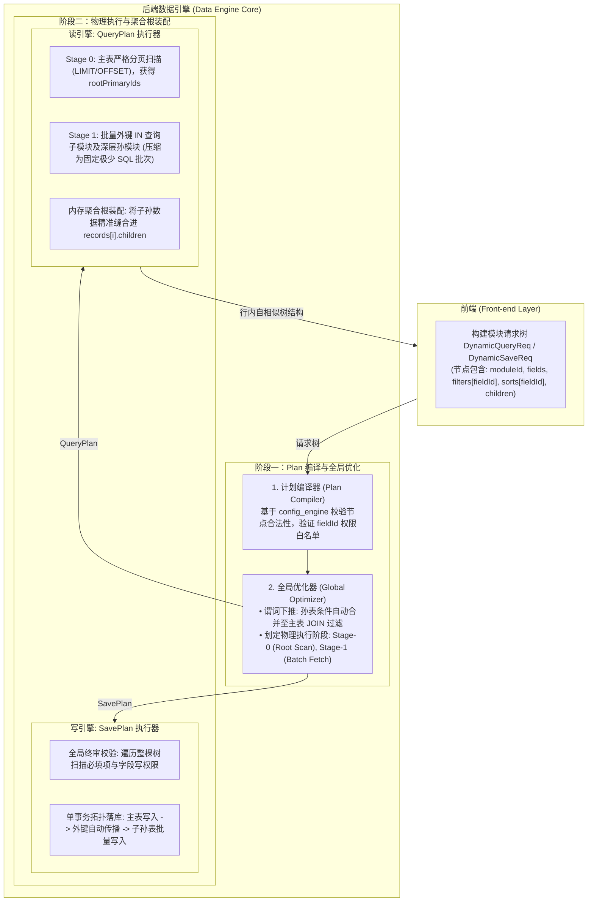

# 数据引擎模块树自相似驱动与读写同构总体设计方案

## 1. 方案背景与核心痛点

在 JDEC 低代码平台日常业务中（以 `MOD-STUDENT-FULL (101)` 学生全景档案为例），业务模型天然呈现层级树状：
- **根模块 101（学生档案）**：主表 `student` + 1:1 伴生档案表 `student_profile` + N:1 班级 `clazz`
- **直接子模块 103（选课与成绩）**：1:N 从表 `student_course`
- **深层孙模块 106（考核分项）**：1:N:N 孙表 `student_course_score_item`
- **同级子模块 104（荣誉奖惩）**：1:N 从表 `student_award`

系统运行依赖两大基础库：
1. **`config_engine`（配置库）**：存储模块树 `sys_module_node`、表头 `sys_module_header`、物理字段 `sys_module_field`、关联拓扑 `sys_module_relation` 及权限 `sys_role_module_field_permission`。
2. **`school`（业务数据物理库）**：存储 `student`、`student_course`、`student_award` 等实际业务表数据。

### 核心痛点与架构矛盾
1. **查询与展示强耦合**：先前设计将数据引擎与表头配置强绑定。表头本质是 UI 表现层，导致引擎无法直接支撑灵活的局部数据提取、Excel 导出及微服务调用。
2. **多 Tab 条件与执行意图各异**：各个子模块 Tab 拥有不同的检索、排序与分页要求，扁平参数难以表达树形业务拓扑。
3. **模糊推导与歧义风险**：客户端传递表名与列名字符串，服务端不仅需编写大量白名单防御防 SQL 注入，且在多表/菱形依赖下容易产生歧义。
4. **N+1 查询风暴与简单递归隐患**：如果引擎只做简单递归查库，面对深层级联将产生巨大网络 I/O 开销，且无法实施跨层全局谓词下推。
5. **读写割裂与行数据错位**：查询返回的树与保存期望的入参不对称；若把子数据平铺在响应顶层，主从数据匹配容易错乱。

---

## 2. 核心架构设计：Plan 编译两阶段模型与自相似模块树

### 2.1 架构第一性原理与总纲

> **模块节点是 Data Engine 的基本执行单元，模块树负责表达业务数据拓扑，每个节点拥有独立的查询/保存意图；Data Engine 将整棵请求树编译成 QueryPlan / SavePlan，而不是简单递归调用数据库。**

1. **基本执行单元（Atomic Execution Unit）**：`DynamicQueryNode` / `DynamicSaveNode` 是独立的意图承载体，各自包含独立的投影（`fields`）、过滤（`filters`）、排序（`sorts`）或保存记录（`records`）。
2. **100% 严密自洽（Zero Guesswork）**：全面引入 `fieldId`（`sys_module_field.id`）作为字段投影、过滤与排序的核心唯一物理凭据，废弃模糊的 `modulePath` 与纯文本表名，消除任何二义性与 SQL 注入隐患。
3. **两阶段执行模型（Two-Phase Execution）**：
   - **阶段一：Plan 编译与全局优化（Compiler & Optimizer）**：语义分析、权限校验、跨层谓词下推（Predicate Pushdown）、拓扑排序与执行阶段划分；
   - **阶段二：物理批处理与聚合根组装（Executor & Assembler）**：以极少数批次 SQL 完成多层拉取，并在内存中自同构缝合为带完整模块上下文的行内树。

### 2.2 总体架构拓扑图



---

## 3. 契约模型设计 (DTO Specification)

### 3.1 字段、过滤与排序契约（基于 `fieldId` 驱动）

#### `DynamicFilterItem.java`（过滤条件项）
```java
package com.jdec.platform.data.api.dto.request;

import io.swagger.v3.oas.annotations.media.Schema;
import java.io.Serializable;
import lombok.AllArgsConstructor;
import lombok.Builder;
import lombok.Data;
import lombok.NoArgsConstructor;

@Data
@Builder
@NoArgsConstructor
@AllArgsConstructor
@Schema(description = "动态过滤条件项（100% 严密自洽，fieldId 驱动）")
public class DynamicFilterItem implements Serializable {
    private static final long serialVersionUID = 1L;

    @Schema(description = "字段权威元数据主键 (sys_module_field.id)，优先使用", example = "1001")
    private Long fieldId;

    @Schema(description = "匹配操作符: EQ, NEQ, LIKE, GT, GTE, LT, LTE, IN, NOT_IN, BETWEEN, IS_NULL, IS_NOT_NULL", example = "EQ")
    private String operator;

    @Schema(description = "过滤值 (单值或数组)")
    private Object value;
}
```

#### `DynamicSortItem.java`（排序规则项）
```java
package com.jdec.platform.data.api.dto.request;

import io.swagger.v3.oas.annotations.media.Schema;
import java.io.Serializable;
import lombok.AllArgsConstructor;
import lombok.Builder;
import lombok.Data;
import lombok.NoArgsConstructor;

@Data
@Builder
@NoArgsConstructor
@AllArgsConstructor
@Schema(description = "动态排序规则项")
public class DynamicSortItem implements Serializable {
    private static final long serialVersionUID = 1L;

    @Schema(description = "字段权威元数据主键 (sys_module_field.id)", requiredMode = Schema.RequiredMode.REQUIRED, example = "1001")
    private Long fieldId;

    @Schema(description = "排序方向: ASC 或 DESC", example = "DESC")
    private String direction;
}
```

---

### 3.2 读契约：自相似模块查询树模型

#### `DynamicQueryNode.java`（通用自相似查询执行单元）
```java
package com.jdec.platform.data.api.dto.request;

import io.swagger.v3.oas.annotations.media.Schema;
import java.io.Serializable;
import java.util.List;
import lombok.AllArgsConstructor;
import lombok.Data;
import lombok.NoArgsConstructor;
import lombok.experimental.SuperBuilder;

@Data
@SuperBuilder
@NoArgsConstructor
@AllArgsConstructor
@Schema(description = "自相似动态模块查询执行单元")
public class DynamicQueryNode implements Serializable {
    private static final long serialVersionUID = 1L;

    @Schema(description = "模块 ID", requiredMode = Schema.RequiredMode.REQUIRED, example = "101")
    private Long moduleId;

    @Schema(description = "页码 (仅在需要分页的节点指定，从 1 开始)", example = "1")
    private Integer pageNum;

    @Schema(description = "每页条数 / 明细上限条数", example = "20")
    private Integer pageSize;

    @Schema(description = "显式投影字段 ID 列表 (sys_module_field.id)。为 null 或空时，默认投影当前模块全部可见字段")
    private List<Long> fields;

    @Schema(description = "专属于当前模块节点的过滤条件列表")
    private List<DynamicFilterItem> filters;

    @Schema(description = "专属于当前模块节点的排序规则列表")
    private List<DynamicSortItem> sorts;

    @Schema(description = "下级子模块查询树列表 (表达业务数据空间拓扑，天然递归嵌套)")
    private List<DynamicQueryNode> children;
}
```

#### `DynamicQueryReq.java`（顶层查询请求入口）
```java
package com.jdec.platform.data.api.dto.request;

import io.swagger.v3.oas.annotations.media.Schema;
import lombok.Data;
import lombok.EqualsAndHashCode;
import lombok.NoArgsConstructor;
import lombok.ToString;
import lombok.experimental.SuperBuilder;

@Data
@SuperBuilder
@NoArgsConstructor
@ToString(callSuper = true)
@EqualsAndHashCode(callSuper = true)
@Schema(description = "动态模块树查询请求模型")
public class DynamicQueryReq extends DynamicQueryNode {
    private static final long serialVersionUID = 1L;
}
```

---

### 3.3 读响应契约：行内自相似嵌套树（Row-Level Self-Similar Response）

为彻底解决前端数据行与明细数据的关联错位问题，子模块数据作为自相似节点严格嵌套在每一条主记录内部：

```json
{
  "code": 200,
  "msg": "success",
  "data": {
    "moduleId": 101,
    "page": {
      "pageNum": 1,
      "pageSize": 20,
      "total": 128,
      "totalPages": 7
    },
    "records": [
      {
        "id": 1,
        "name": "张三",
        "student_no": "S2026001",
        "grade": "2026级",
        
        // 核心：张三所属的子模块数据，严格在行内挂载，带权威 moduleId 上下文
        "children": [
          {
            "moduleId": 103,
            "parentForeignKey": "student_id",
            "records": [
              {
                "id": 1001,
                "course_name": "高等数学",
                "score": 92.5,
                // 孙模块递归嵌套
                "children": [
                  {
                    "moduleId": 106,
                    "parentForeignKey": "course_id",
                    "records": [
                      { "id": 5001, "item_name": "阶段小测一", "score": 95.0 }
                    ]
                  }
                ]
              },
              {
                "id": 1002,
                "course_name": "大学物理",
                "score": 88.0,
                "children": []
              }
            ]
          }
        ]
      }
    ]
  }
}
```

---

### 3.4 写契约：自相似读写同构保存树模型

写模型与读响应模型在结构上完全对称同构，前端编辑完成后可将整棵树或局部子树直接原样回传：

#### `DynamicSaveNode.java`（通用自相似保存执行单元）
```java
package com.jdec.platform.data.api.dto.request;

import io.swagger.v3.oas.annotations.media.Schema;
import java.io.Serializable;
import java.util.List;
import java.util.Map;
import lombok.AllArgsConstructor;
import lombok.Data;
import lombok.NoArgsConstructor;
import lombok.experimental.SuperBuilder;

@Data
@SuperBuilder
@NoArgsConstructor
@AllArgsConstructor
@Schema(description = "自相似动态模块保存执行单元")
public class DynamicSaveNode implements Serializable {
    private static final long serialVersionUID = 1L;

    @Schema(description = "模块 ID", requiredMode = Schema.RequiredMode.REQUIRED, example = "101")
    private Long moduleId;

    @Schema(description = "当前模块数据行记录集 (支持单行或多行)")
    private List<Map<String, Object>> records;

    @Schema(description = "下级子模块保存树列表 (自相似递归同构)")
    private List<DynamicSaveNode> children;
}
```

#### `DynamicSaveReq.java`（顶层保存请求模型）
```java
package com.jdec.platform.data.api.dto.request;

import io.swagger.v3.oas.annotations.media.Schema;
import lombok.Data;
import lombok.EqualsAndHashCode;
import lombok.NoArgsConstructor;
import lombok.ToString;
import lombok.experimental.SuperBuilder;

@Data
@SuperBuilder
@NoArgsConstructor
@ToString(callSuper = true)
@EqualsAndHashCode(callSuper = true)
@Schema(description = "动态主子表同构原子保存请求模型")
public class DynamicSaveReq extends DynamicSaveNode {
    private static final long serialVersionUID = 1L;

    @Schema(description = "父级主表主键 ID (用于单 Tab 独立暂存时关联已存在的主记录)", example = "42")
    private Long rootPrimaryId;

    @Schema(description = "是否执行全局完整性终审校验 (true 时触发全模块必填项强校验)", example = "false")
    private Boolean validateRequired;
}
```

---

## 4. 引擎内核：QueryPlan 与 SavePlan 编译执行细节

### 4.1 QueryPlan 编译与执行机制

1. **AST 语义校验与字段解析**：
   - 遍历请求树各节点的 `fields`、`filters` 与 `sorts`；
   - 通过 `fieldId` 检索 `MetadataCacheService` 缓存的 `ModuleFieldDTO`，校验字段归属与读取权限；
   - 解析出权威物理表名 `tableName`、物理列名 `columnName` 及 SQL 数据类型。
2. **跨层谓词下推与全局优化（Optimizer）**：
   - 根据“模块连接树定理”，根节点到任意孙节点的 JOIN 路径在数学上有且仅有一条确定链条；
   - 若根节点或子节点指定了深层孙表的检索条件（如根据“阶段小测一”筛选学生），优化器自动将孙表 JOIN 路径折叠下推至根主表的过滤子句中，确保 `LIMIT/OFFSET` 作用后的学生主记录绝对精准。
3. **分阶段物理批量执行（Stage Pipeline）**：
   - **Stage 0 (Root Scan)**：执行主表分页 SQL，获得当前批次 `rootPrimaryIds`（如 `[1, 2, ..., 20]`）；
   - **Stage 1 (Sub-Module Batch Fetch)**：利用 `rootPrimaryIds`，以 `student_id IN (...)` 批量获取选课数据，绝无 N+1 循环；
   - **Stage 2 (Grandchild Batch Fetch)**：以选课主键集合为条件，批量获取考核明细；
   - **Stage 3 (In-Memory Assembler)**：在内存中以 Hash 映射缝合，组装为行内自相似嵌套树返回。

### 4.2 SavePlan 编译与执行机制

1. **依赖拓扑排序与终审校验**：
   - 若 `validateRequired = true`，扫描整棵保存树，核验 `sys_module_field.required` 必填约束；
   - 确定拓扑序：根节点（Master）-> 直接子节点（Sub）-> 深层孙节点（Grandchild）。
2. **单事务级联落库与外键自动传播**：
   - 开启单事务 `@Transactional(rollbackFor = Exception.class)`；
   - **根节点保存**：执行 Upsert（有主键更新，无主键插入），生成 `currentId`；
   - **外键传播与子节点落库**：从模块关联元数据 `sys_module_relation` 中推导外键列（如 `student_id`），自动将 `currentId` 注入子记录，批量持久化子记录集；
   - 递归完成全树入库，提交事务并触发数据快照（Snapshot）。

---

## 5. 典型业务调用场景展示

### 场景 1：学生管理首页列表（纯 fieldId 过滤 + 排序，不展开子模块）
```json
POST /api/data/engine/query
{
  "moduleId": 101,
  "pageNum": 1,
  "pageSize": 20,
  "fields": [1001, 1002, 1003],
  "filters": [
    { "fieldId": 1002, "operator": "LIKE", "value": "S2026001" },
    { "fieldId": 1008, "operator": "EQ", "value": "2026级" }
  ],
  "sorts": [
    { "fieldId": 1001, "direction": "DESC" }
  ]
}
```

### 场景 2：学生全景抽屉（主模块详情 + 选课 Tab 独立过滤与考核明细展开）
```json
POST /api/data/engine/query
{
  "moduleId": 101,
  "filters": [
    { "fieldId": 1001, "operator": "EQ", "value": 42 }
  ],
  "children": [
    {
      "moduleId": 103,
      "filters": [
        { "fieldId": 2003, "operator": "EQ", "value": "2026-秋" }
      ],
      "sorts": [
        { "fieldId": 2004, "direction": "DESC" }
      ],
      "children": [
        {
          "moduleId": 106
        }
      ]
    }
  ]
}
```

### 场景 3：单 Tab 独立暂存（在选课 Tab 保存，不影响主表与其他 Tab）
```json
POST /api/data/engine/save
{
  "moduleId": 101,
  "rootPrimaryId": 42,
  "children": [
    {
      "moduleId": 103,
      "records": [
        { "id": 1, "course_name": "操作系统", "score": 95 },
        { "course_name": "计算机网络", "score": 88 }
      ]
    }
  ]
}
```

### 场景 4：全量提交与全局终审校验
```json
POST /api/data/engine/save
{
  "moduleId": 101,
  "validateRequired": true,
  "records": [
    { "id": 42, "name": "张三", "emergency_phone": "13900000000" }
  ],
  "children": [
    {
      "moduleId": 103,
      "records": [
        { "course_name": "操作系统", "score": 95 }
      ]
    }
  ]
}
```

---

## 6. 代码落地改造清单

| 层次 | 文件路径 | 核心改造内容 |
| :--- | :--- | :--- |
| **API 契约** | `.../data/api/dto/request/DynamicFilterItem.java` | **[改造]** 引入 `fieldId`，平滑向下兼容旧属性；标记 `modulePath` 为废弃 |
| **API 契约** | `.../data/api/dto/request/DynamicSortItem.java` | **[改造]** 引入 `fieldId`，平滑向下兼容旧属性 |
| **API 契约** | `.../data/api/dto/request/DynamicQueryNode.java` | **[新增]** 自相似查询执行单元基类（包含 moduleId, pageNum, pageSize, fields, filters, sorts, children） |
| **API 契约** | `.../data/api/dto/request/DynamicQueryReq.java` | **[改造]** 继承 `DynamicQueryNode`，使根请求天然具备树拓扑表达力 |
| **API 契约** | `.../data/api/dto/response/DynamicDataNode.java` | **[新增]** 行内自相似响应节点，挂载于 `records[i].children` |
| **API 契约** | `.../data/api/dto/request/DynamicSaveNode.java` | **[新增]** 自相似保存执行单元基类（包含 moduleId, records, children） |
| **API 契约** | `.../data/api/dto/request/DynamicSaveReq.java` | **[改造]** 继承 `DynamicSaveNode`，引入 `rootPrimaryId` 与 `validateRequired` |
| **Plan 编译** | `.../data/biz/dsl/JooqConditionBuilder.java` | **[改造]** 改为优先基于 `fieldId` 从元数据 Map 提取权威表名、列名与类型，构建安全 SQL 条件 |
| **Plan 编译** | `.../data/biz/dsl/JooqSqlBuilder.java` | **[改造]** 支持按 `fields` 字段投影列表动态生成 SELECT 物理列；构建跨层下推路径 |
| **Plan 执行** | `.../data/biz/service/DynamicQueryService.java` | **[改造]** 升级为 QueryPlan 分阶段批量拉取，并在内存中聚合装配为行内自相似树 |
| **Plan 执行** | `.../data/biz/service/DynamicPersistenceService.java`| **[改造]** 升级为 SavePlan 拓扑有序落库与外键自动传播，支持局部暂存与终审校验 |
| **单元测试** | `.../data/biz/DataEngineQueryTest.java` | **[增强]** 增加基于 `fieldId` 驱动的单模块与自相似多层树检索测试用例 |
| **单元测试** | `.../data/biz/DataEnginePersistenceTest.java` | **[增强]** 增加行内自相似树事务保存与局部暂存测试用例 |

---

## 7. 方案演进总结

通过本次架构升级，数据引擎达成了三大核心跃迁：
1. **从“业务胶水”跃迁至“执行计划编译模型”**：由 `QueryPlan` / `SavePlan` 统一负责编译与优化，彻底终结 N+1 递归性能隐患；
2. **从“模糊推导”跃迁至“100% 严密自洽”**：以 `fieldId` 为单一真理源，彻底杜绝歧义、多路径猜错与 SQL 注入风险；
3. **从“读写割裂”跃迁至“读写同构与行内闭环”**：请求、响应与持久化在模块树形态上实现对称闭环，为后续做成通用的 `data-engine-spring-boot-starter` 奠定了纯净、坚实的内核基础。
