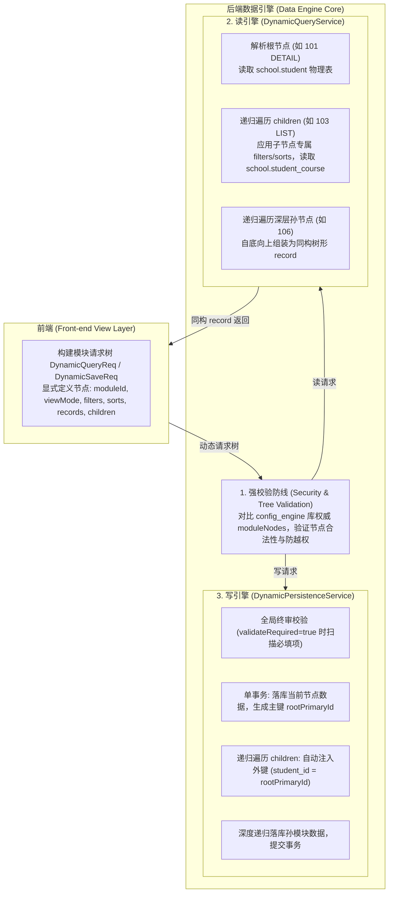

# 数据引擎模块树自相似驱动与读写同构总体设计方案

## 1. 方案背景与核心痛点

在 JDEC 低代码平台日常业务中（以 `MOD-STUDENT-FULL (101)` 学生全景档案为例），业务模型天然呈现层级树状：
- **根模块 101（学生档案）**：主表 `student` + 1:1 伴生档案表 `student_profile` + N:1 班级 `clazz`
- **直接子模块 103（选课与成绩）**：1:N 从表 `student_course`
- **深层孙模块 106（考核分项）**：1:N:N 孙表 `student_course_score_item`
- **同级子模块 104（荣誉奖惩）**：1:N 从表 `student_award`

系统运行依赖两大基础库：
1. **`config_engine`（配置库）**：存储模块树 `sys_module_node`、表头 `sys_module_header`、物理字段 `sys_module_field`、关联拓扑 `sys_module_relation` 及权限 `sys_role_module_field_permission`。
2. **`school`（业务数据物理库）**：存储 `student`、`student_course`、`student_award` 等实际业务表数据。

### 核心痛点与架构矛盾
1. **多 Tab 条件各异**：各个 Tab（子模块）拥有完全不同的检索条件（如选课需要过滤学期和分数排序，奖惩需要按级别过滤），简单的扁平入参无法差异化表达各子模块的检索意图。
2. **多 Tab 分步保存与暂存**：用户在选课 Tab 录入并点击保存时，只想更新选课数据，不应覆盖或重新保存未变动的主模块或其他 Tab；而最后全量提交时，又需要触发跨 Tab 的全局终审校验。
3. **读写割裂**：查询接口返回的是层级树状数据，保存接口却只支持单模块平铺表名保存，迫使前端编写大量解构和包装的胶水代码。
4. **后端“猜测”前端视图意图**：后端面对 `viewMode` 时，无法准确推断出各个子模块究竟是应该按 `DETAIL`（表单）还是按 `LIST`（表格）形态组装。

---

## 2. 核心架构设计：模块树自相似驱动（Self-Similar Tree Architecture）

### 2.1 架构设计第一性原理
> **前端声明视图意图，后端守门强校验，模块树作为自相似递归的统一单元贯穿读写全生命周期。**

将模块请求抽象为自相似的树节点（`DynamicQueryNode` / `DynamicSaveNode`），树上的每一个节点（无论是根模块、子模块还是孙模块）都是一个平等的、自包含的业务单元。

### 2.2 读写架构总体拓扑



---

## 3. 契约模型设计 (DTO Specification)

### 3.1 读契约：自相似模块查询树模型

#### `DynamicQueryNode.java`（通用自相似节点基类）
```java
package com.jdec.platform.data.api.dto.request;

import io.swagger.v3.oas.annotations.media.Schema;
import java.io.Serializable;
import java.util.List;
import lombok.AllArgsConstructor;
import lombok.Data;
import lombok.NoArgsConstructor;
import lombok.experimental.SuperBuilder;

@Data
@SuperBuilder
@NoArgsConstructor
@AllArgsConstructor
@Schema(description = "自相似动态模块查询节点")
public class DynamicQueryNode implements Serializable {
    private static final long serialVersionUID = 1L;

    @Schema(description = "模块 ID", requiredMode = Schema.RequiredMode.REQUIRED, example = "101")
    private Long moduleId;

    @Schema(description = "视图模式: LIST(列表-严格按表头headers驱动), DETAIL(详情-严格按模块物理字段fields驱动)", example = "LIST")
    private String viewMode;

    @Schema(description = "页码 (从 1 开始，针对当前模块列表)", example = "1")
    private Integer pageNo;

    @Schema(description = "每页条数 / 明细上限条数", example = "20")
    private Integer pageSize;

    @Schema(description = "专属于当前模块的过滤条件列表")
    private List<DynamicFilterItem> filters;

    @Schema(description = "专属于当前模块的排序规则列表")
    private List<DynamicSortItem> sorts;

    @Schema(description = "下级子模块查询树列表 (天然递归嵌套)")
    private List<DynamicQueryNode> children;
}
```

#### `DynamicQueryReq.java`（顶层查询请求模型）
直接继承 `DynamicQueryNode`，使根请求天然具备树形扩展能力，同时完美兼容传统单模块调用：
```java
package com.jdec.platform.data.api.dto.request;

import io.swagger.v3.oas.annotations.media.Schema;
import lombok.Data;
import lombok.EqualsAndHashCode;
import lombok.NoArgsConstructor;
import lombok.ToString;
import lombok.experimental.SuperBuilder;

@Data
@SuperBuilder
@NoArgsConstructor
@ToString(callSuper = true)
@EqualsAndHashCode(callSuper = true)
@Schema(description = "动态列表/全景分页查询请求模型")
public class DynamicQueryReq extends DynamicQueryNode {
    private static final long serialVersionUID = 1L;

    @Schema(description = "是否递归加载子孙模块(默认依据 viewMode 自动推导: LIST 默认为 true, DETAIL 默认为 false)")
    private Boolean recursive;
}
```

---

### 3.2 写契约：自相似模块保存树模型

#### `DynamicSaveNode.java`（通用自相似保存节点）
```java
package com.jdec.platform.data.api.dto.request;

import io.swagger.v3.oas.annotations.media.Schema;
import java.io.Serializable;
import java.util.List;
import java.util.Map;
import lombok.AllArgsConstructor;
import lombok.Data;
import lombok.NoArgsConstructor;
import lombok.experimental.SuperBuilder;

@Data
@SuperBuilder
@NoArgsConstructor
@AllArgsConstructor
@Schema(description = "自相似动态模块保存节点")
public class DynamicSaveNode implements Serializable {
    private static final long serialVersionUID = 1L;

    @Schema(description = "模块 ID", requiredMode = Schema.RequiredMode.REQUIRED, example = "101")
    private Long moduleId;

    @Schema(description = "单行物理表数据集 (对齐详情返回的物理表对象，Key 为表名)")
    private Map<String, Object> record;

    @Schema(description = "多行物理表数据集列表 (对齐列表返回的行数据，如 student_course 列表)")
    private List<Map<String, Object>> records;

    @Schema(description = "下级子模块保存树列表 (自相似递归)")
    private List<DynamicSaveNode> children;
}
```

#### `DynamicSaveReq.java`（顶层保存请求模型）
```java
package com.jdec.platform.data.api.dto.request;

import io.swagger.v3.oas.annotations.media.Schema;
import lombok.Data;
import lombok.EqualsAndHashCode;
import lombok.NoArgsConstructor;
import lombok.ToString;
import lombok.experimental.SuperBuilder;

@Data
@SuperBuilder
@NoArgsConstructor
@ToString(callSuper = true)
@EqualsAndHashCode(callSuper = true)
@Schema(description = "动态主子表同构原子保存请求模型")
public class DynamicSaveReq extends DynamicSaveNode {
    private static final long serialVersionUID = 1L;

    @Schema(description = "父级主表主键 ID (用于单 Tab 独立暂存时关联已存在的主表记录)", example = "42")
    private Long rootPrimaryId;

    @Schema(description = "是否执行全局完整性终审校验 (true 时触发全模块必填与规则强校验)", example = "false")
    private Boolean validateRequired;
}
```

---

## 4. 核心执行引擎实现细节

### 4.1 安全防线：模块树合法性强校验
任何进入引擎的请求树，必须在第一步接受校验：
1. 后端调用 `metadataCacheService.getModuleComplete(rootModuleId)` 从 `config_engine` 读取权威模块拓扑；
2. 递归验证：前端 `children` 中的每一个 `moduleId`，必须真正隶属于其父模块管辖（`node.getParentId().equals(parentNode.getModuleId())`）；
3. 杜绝客户端伪造跨业务越权节点，构建安全防线。

### 4.2 读引擎执行机制 (`DynamicQueryService`)
1. **`recursive` 与 `viewMode` 决策规则**：
   - 根模块入参未传 `recursive` 时，遵循业务规则：`"LIST"` 模式默认为 `true`（按表头自动递归），`"DETAIL"` 模式默认为 `false`（默认不递归）；
   - 若显式传入 `children` 树，则以树的具体声明为准；
   - 树中各节点各自的 `viewMode` 严格生效（主节点为 `DETAIL`，子节点声明为 `LIST` 则按表头组装子表格）。
2. **递归查询与同构装配**：
   - 根模块执行分页与主表 Join 查询；
   - 遍历 `children`：为每一个子节点应用专属于该节点的 `filters` 与 `sorts`，批量拉取从表数据；
   - 统一组装为 `record: { "[moduleId]": { [tableName]: ... } }` 同构纯对象空间。

### 4.3 写引擎执行机制 (`DynamicPersistenceService`)
1. **终审校验（Validation Guard）**：
   - 若 `validateRequired == true`，沿着保存树遍历节点，结合 `sys_module_field` 校验各模块必填字段；
   - 若有错误，返回包含 `moduleId`、`tableName`、`fieldName`、`message` 的结构化校验报告，阻断事务。
2. **级联事务落库与外键自动传播**：
   - 单事务 `@Transactional(rollbackFor = Exception.class)` 启动；
   - **当前节点落库**：
     - 若上下文存在父级主键 `parentId`，从元数据 `tableRelations` 自动匹配发现外键列（如 `student_id`），静默自动注入；
     - 执行 Upsert（有 `id` 更新，无 `id` 插入），获取当前物理主键 `currentId`；
   - **递归处理子节点**：
     - 递归处理当前节点下的 `children` 列表，将 `currentId` 作为父主键传递给子节点处理函数；
   - 树遍历结束，事务提交，返回根主键。

---

## 5. 典型业务调用场景展示

### 场景 1：学生管理列表页（只查主表名册，不递归从表）
```json
POST /api/data/engine/query
{
  "moduleId": 101,
  "viewMode": "LIST",
  "pageNo": 1,
  "pageSize": 20
}
```

### 场景 2：学生全景抽屉（主模块详情 + 选课 Tab 独立过滤与排序）
```json
POST /api/data/engine/query
{
  "moduleId": 101,
  "viewMode": "DETAIL",
  "filters": [
    { "tableName": "student", "columnName": "id", "value": 42 }
  ],
  "children": [
    {
      "moduleId": 103,
      "viewMode": "LIST",
      "filters": [
        { "tableName": "student_course", "columnName": "semester", "value": "2026-秋" }
      ],
      "sorts": [
        { "tableName": "student_course", "columnName": "score", "direction": "DESC" }
      ]
    },
    {
      "moduleId": 104,
      "viewMode": "LIST"
    }
  ]
}
```

### 场景 3：单 Tab 独立暂存（在选课 Tab 保存，不触碰主表与其他 Tab）
```json
POST /api/data/engine/save
{
  "moduleId": 101,
  "rootPrimaryId": 42,
  "children": [
    {
      "moduleId": 103,
      "records": [
        { "id": 1, "course_name": "操作系统", "score": 95 },
        { "course_name": "计算机网络", "score": 88 }
      ]
    }
  ]
}
```

### 场景 4：全量提交与终审校验
```json
POST /api/data/engine/save
{
  "moduleId": 101,
  "validateRequired": true,
  "record": {
    "student": { "id": 42, "name": "张三" },
    "student_profile": { "emergency_phone": "13900000000" }
  },
  "children": [
    {
      "moduleId": 103,
      "records": [
        { "course_name": "操作系统", "score": 95 }
      ]
    }
  ]
}
```

---

## 6. 代码落地与修改清单

| 层次 | 文件路径 | 核心改造内容 |
| :--- | :--- | :--- |
| **API 契约** | `.../data/api/dto/request/DynamicQueryNode.java` | **[新增]** 自相似模块查询节点基类（包含 moduleId, viewMode, filters, sorts, children） |
| **API 契约** | `.../data/api/dto/request/DynamicQueryReq.java` | **[改造]** 继承 `DynamicQueryNode`，新增 `recursive` 字段，保持 100% 向下兼容 |
| **API 契约** | `.../data/api/dto/request/DynamicSaveNode.java` | **[新增]** 自相似模块保存节点基类（包含 moduleId, record, records, children） |
| **API 契约** | `.../data/api/dto/request/DynamicSaveReq.java` | **[改造]** 继承 `DynamicSaveNode`，引入 `rootPrimaryId` 与 `validateRequired` |
| **业务实现** | `.../data/biz/service/DynamicQueryService.java` | **[改造]** 支持沿着 `DynamicQueryNode` 递归执行各子模块独立过滤与多视图模式组装 |
| **业务实现** | `.../data/biz/service/DynamicPersistenceService.java`| **[改造]** 支持按模块保存树递归注入外键落库，支持单 Tab 局部暂存与全局终审校验 |
| **单元测试** | `.../data/biz/DataEnginePersistenceTest.java` | **[新增]** 模块树级联查询测试、单 Tab 独立暂存测试、全量终审校验测试 |

---

## 7. 方案演进与后续扩展

1. **元数据默认配置**：后续可在 `config_engine` 的 `sys_module` 或 `sys_module_node` 表中增加 `default_view_mode: LIST/DETAIL`，作为节点缺省视图模式，请求中的 `viewMode` 仅作为前端临时覆盖。
2. **批量保存性能优化**：对于超大体量从表，在递归落库阶段可无缝切换为 jOOQ `batchInsert` / `batchUpdate`，保持树形外键语义不变的同时提升高并发吞吐。
