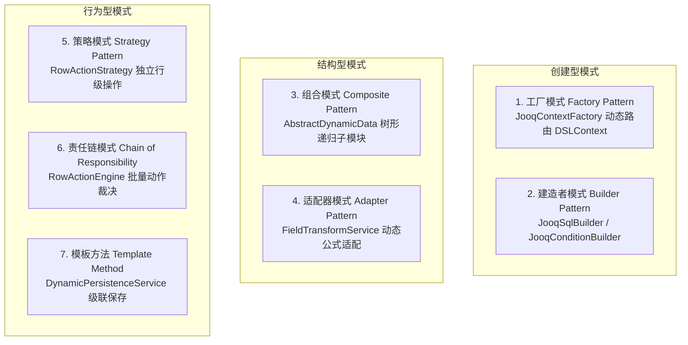
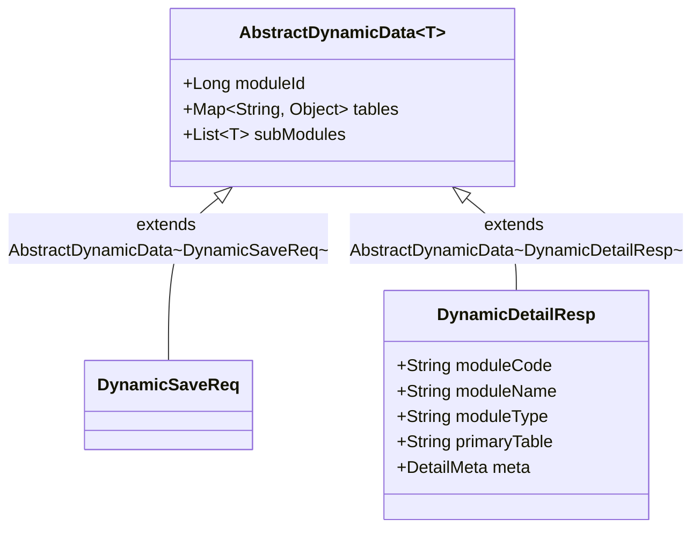
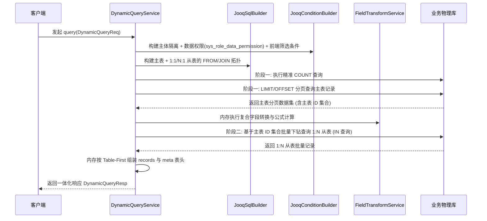

# JDEC 动态数据引擎 (Data Engine) 核心架构与设计文档

## 1. 概述与核心使命

`jdec-platform-data-engine` 是 JDEC 低代码平台中的**核心执行引擎与数据底座**。它的核心使命是：
> **基于配置中心（`config_center`）中定义的 `SysModule`（系统模块）及其元数据（表关系、字段字典、表头配置、权限规则），在完全物理隔离的业务库（如 `student_manage`）中，动态执行主子表聚合数据的增、改、查、分页与全生命周期快照追溯。**

---

## 2. 核心架构设计理念与第一性原理 (Core Philosophy & First Principles)

数据引擎的整体架构设计始终恪守 **KISS（Keep It Simple, Stupid）** 与 **第一性原理（First Principles Thinking）**，深度融合了以下六大核心设计理念：

### 2.1 元数据驱动（Metadata-Driven Architecture）
业务模型不依赖静态实体类编码，而是由配置库中的 `SysModule`、`sys_module_table`、`sys_module_field` 动态定义。数据引擎在运行时动态将元数据编译为高效的 SQL 执行计划。

### 2.2 读写同构（Isomorphic Read/Write Model）
打破传统开发中“读用一套 DTO、写用另一套 DTO、前端反复转换”的冗余设计。后端详情接口给出的数据结构与保存接口接收的数据结构高度镜像，实现 **“所见即所得、原样回传”** 的零胶水层开发体验。

### 2.3 关注点分离与多数据源物理隔离（Physical Multi-DB Isolation）
- **配置库（`config_center`）**：关注“系统规则与模型定义”；
- **业务库（如 `student_manage`）**：关注“真实业务数据与数据快照”；
- 两库在物理连接、事务边界与数据流上彻底解耦，互不污染。

### 2.4 两阶段数据装配（Two-Phase Data Assembly）
摒弃在单个 SQL 中强行 `LEFT JOIN` 1:N 从表的反模式，采用“阶段一主表精确物理分页 + 阶段二外键下钻批量组装”，从根源上消除笛卡尔积导致的分页行数膨胀和 `COUNT` 统计失真。

### 2.5 终结态快照与增量追溯（Terminal State Snapshot & RFC 6902 Diff）
遵循“日常保存轻量高吞吐，审批终结归档可追溯”的原则。日常物理维护零快照开销；仅在审批完成终结（`99` 生效 或 `-99` 作废）时触发快照树打包，并基于 RFC 6902 标准计算增量 Diff。

### 2.6 四维立体权限解耦（Multi-Dimensional Decoupled Permissions）
将权限从“页面路由、列级字段、行级数据、操作级按钮”四个维度正交分解，各司其职，保证极高的扩展性与安全性。

---

## 3. 运用的经典设计模式全景 (Design Patterns in Practice)

在数据引擎的实现过程中，深度实践了 GoF 经典设计模式与现代企业级架构模式：



### 3.1 工厂模式 (Factory Pattern) —— `JooqContextFactory`
- **应用场景**：多租户/多项目物理数据库动态路由。
- **设计实现**：封装 `DataSourceResolver`，根据当前线程上下文 `AppContext.getProjectNo()` 动态获取目标业务库的 `DataSource`，并实例化对应方言的 `DSLContext`。业务上层无需关心底层数据库连接的切换细节。

### 3.2 建造者模式 (Builder Pattern) —— `JooqSqlBuilder` & `JooqConditionBuilder`
- **应用场景**：动态复杂 SQL 的安全组装。
- **设计实现**：基于流式接口（Fluent API），根据 `SysModuleCompleteResp` 中的主从表 Join 关系与前端动态 `filters`，逐步构建参数化的 jOOQ `SelectJoinStep` 和 `Condition`，天然免疫 SQL 注入。

### 3.3 组合模式 (Composite Pattern) —— `AbstractDynamicData<T>`
- **应用场景**：无限级嵌套的模块树（父模块详情挂载多个独立子模块）。
- **设计实现**：通过自引用的泛型抽象基类 `AbstractDynamicData<T>`（包含 `moduleId`, `tables`, `List<T> subModules`），使单个模块与复合子模块树拥有完全一致的访问与操作接口。

### 3.4 策略模式 (Strategy Pattern) —— `RowActionStrategy`
- **应用场景**：单据行级操作按钮（`EDIT`、`SUBMIT_APPROVAL`、`APPROVE`、`VIEW_HISTORY` 等）的独立决策。
- **设计实现**：将每个操作按钮的判定逻辑（结合单据态与审批链上下文）独立封装为一个策略类（如 `ApproveActionStrategy`、`EditActionStrategy`）。新增操作类型时只需新增策略类，严格满足 **开闭原则（OCP）**。

### 3.5 责任链与聚合裁决模式 (Chain of Evaluation) —— `RowActionEngine`
- **应用场景**：列表查询时批量裁决每行记录的可用操作集合 `_actions`。
- **设计实现**：`RowActionEngine` 自动装配所有 Spring 托管的策略，先批量预加载当前页单据的审批链状态（避免 N+1 慢查询），再依次执行策略过滤，聚合生成每行单据的动作白名单。

### 3.6 模板方法模式 (Template Method Pattern) —— `DynamicPersistenceService`
- **应用场景**：主从表级联原子保存。
- **设计实现**：固化“主表权限校验 -> 主表 Insert/Update -> 提取自增主键 -> 回填外键 -> 级联保存关联从表”的标准持久化骨架算法，具体表字段与外键绑定由元数据动态注入。

---

## 4. 读写同构契约模型与 API 设计

### 4.1 领域模型继承体系 (`AbstractDynamicData`)



### 4.2 物理表数据映射规范 (`tables: Map<String, Object>`)
- **Key**：物理表名（如 `student`、`student_profile`、`score`）；
- **Value**：
  - **主表 / 1:1 从表 / N:1 从表**：直接为单个对象字典 `Map<String, Object>`；
  - **1:N 从表**：直接为对象列表 `List<Map<String, Object>>`。

### 4.3 详情响应完整 JSON 结构 (`DynamicDetailResp`)

```json
{
  "code": 200,
  "msg": "操作成功",
  "data": {
    "moduleId": 134,
    "moduleCode": "STUDENT-DETAIL",
    "moduleName": "学生详情",
    "moduleType": "DETAIL",
    "primaryTable": "student",

    // 1. tables: 真实物理表业务数据
    "tables": {
      "student": {
        "id": 1001,
        "student_no": "2026001",
        "student_name": "张三",
        "gender": 1,
        "enrollment_date": "2026-09-01",
        "approval_status": 0
      },
      "student_profile": {
        "id": 501,
        "parent_name": "张父",
        "emergency_phone": "13800138000"
      },
      "score": [
        { "id": 801, "course_name": "高等数学", "score": 95.0 }
      ]
    },

    // 2. meta: 显示名字典与三权白名单
    "meta": {
      "fieldNames": {
        "student": { "student_no": "学号", "student_name": "学生姓名", "gender": "性别" },
        "student_profile": { "parent_name": "家长姓名", "emergency_phone": "紧急联系电话" }
      },
      "permissions": {
        "student": {
          "view": ["id", "student_no", "student_name", "gender", "enrollment_date"],
          "apply": ["student_no", "student_name", "gender", "enrollment_date"],
          "edit": ["student_name", "gender", "enrollment_date"] // 学号只读不可改
        }
      }
    },

    // 3. subModules: 标准递归子模块列表 (同样包含自身 meta 与 tables)
    "subModules": []
  }
}
```

---

## 5. 两阶段分页与动态查询引擎 (`DynamicQueryService`)

为了支持复杂的多表关联与 1:N 级联展示，查询引擎采用**两阶段流水线架构**：



---

## 6. 四维立体权限体系设计

| 权限维度 | 作用范围 | 依赖数据与规则 | 引擎实现与设计模式 |
| :--- | :--- | :--- | :--- |
| **列级字段权限** | 字段显隐与只读 | `sys_role_module_field_permission` | 详情返回 `meta.permissions`（`view/apply/edit`），写操作时校验拦截 |
| **行级数据权限** | 行级记录隔离 | `sys_data_permission` (`tableName*columnName`) + `sys_role_data_permission` (`biz_name` 离散值) | jOOQ 拦截器动态拼接 `WHERE tableName.columnName IN (...)` 强制隔离 |
| **全局互动权限** | 页面顶部通用按钮 | `sys_menu (type=button)` | 前端指令（`v-hasPerm`）独立判定（如“新增”、“批量导出”） |
| **行级互动权限** | 单据操作列按钮 | **审批链当前节点 + 单据当前审批状态** | **策略模式 + 责任链**，由 `RowActionEngine` 在每行动态下发 `_actions: ["VIEW", "EDIT", ...]` |

---

## 7. 多版本快照与 Diff 差异引擎 (`SnapshotManagerService`)

### 7.1 物理存储与建表
引擎会在业务库中自适应创建 `data_engine_snapshot` 表，与业务物理数据共库同源：

```sql
CREATE TABLE IF NOT EXISTS `data_engine_snapshot` (
  `id` BIGINT NOT NULL AUTO_INCREMENT COMMENT '快照主键ID',
  `module_id` BIGINT NOT NULL COMMENT '所属 SysModule ID',
  `data_id` BIGINT NOT NULL COMMENT '业务主表主键 ID (聚合根 ID)',
  `version_no` INT NOT NULL COMMENT '版本号 (1, 2, 3...)',
  `business_no` VARCHAR(100) NULL COMMENT '业务单据编号',
  `final_status_value` INT NOT NULL COMMENT '终结状态值: 99-生效归档, -99-终止作废',
  `json_data` LONGTEXT NOT NULL COMMENT '完整聚合快照 JSON',
  `change_diff` LONGTEXT NULL COMMENT '与上一版本的 RFC 6902 JSON Patch 差异',
  `remark` VARCHAR(500) NULL COMMENT '归档备注',
  `created_by` BIGINT NULL COMMENT '归档人ID',
  `created_date` DATETIME NOT NULL DEFAULT CURRENT_TIMESTAMP COMMENT '归档时间',
  PRIMARY KEY (`id`),
  KEY `idx_module_data_ver` (`module_id`, `data_id`, `version_no`)
) ENGINE=InnoDB DEFAULT CHARSET=utf8mb4 COMMENT='数据引擎多版本快照归档表';
```

### 7.2 差异比对 (`SnapshotDiffEngine`)
采用标准 **RFC 6902 JSON Patch** 算法（`zjsonpatch`），支持：
1. 快照生成时自动与 `version - 1` 生成结构化增量差异（`change_diff`）；
2. 开放任意两版本对比接口（`POST /diff`），精准定位每次审批归档修改了哪些物理表的哪些字段。

---

## 8. 模块类结构与代码全景索引

- **API 契约模块 (`jdec-platform-data-engine-api`)**:
  - 基类与实体：[AbstractDynamicData.java](file:///d:/work/jdec-platform-github/jdec-platform-data-engine-api/src/main/java/com/jdec/platform/dataengine/api/dto/model/AbstractDynamicData.java), [DetailMeta.java](file:///d:/work/jdec-platform-github/jdec-platform-data-engine-api/src/main/java/com/jdec/platform/dataengine/api/dto/model/DetailMeta.java), [TablePermission.java](file:///d:/work/jdec-platform-github/jdec-platform-data-engine-api/src/main/java/com/jdec/platform/dataengine/api/dto/model/TablePermission.java)
  - 请求模型：[DynamicQueryReq.java](file:///d:/work/jdec-platform-github/jdec-platform-data-engine-api/src/main/java/com/jdec/platform/dataengine/api/dto/request/DynamicQueryReq.java), [DynamicSaveReq.java](file:///d:/work/jdec-platform-github/jdec-platform-data-engine-api/src/main/java/com/jdec/platform/dataengine/api/dto/request/DynamicSaveReq.java), [DynamicSnapshotTriggerReq.java](file:///d:/work/jdec-platform-github/jdec-platform-data-engine-api/src/main/java/com/jdec/platform/dataengine/api/dto/request/DynamicSnapshotTriggerReq.java)
  - 响应模型：[DynamicQueryResp.java](file:///d:/work/jdec-platform-github/jdec-platform-data-engine-api/src/main/java/com/jdec/platform/dataengine/api/dto/response/DynamicQueryResp.java), [DynamicDetailResp.java](file:///d:/work/jdec-platform-github/jdec-platform-data-engine-api/src/main/java/com/jdec/platform/dataengine/api/dto/response/DynamicDetailResp.java), [DataSnapshotResp.java](file:///d:/work/jdec-platform-github/jdec-platform-data-engine-api/src/main/java/com/jdec/platform/dataengine/api/dto/response/DataSnapshotResp.java), [VersionDiffResp.java](file:///d:/work/jdec-platform-github/jdec-platform-data-engine-api/src/main/java/com/jdec/platform/dataengine/api/dto/response/VersionDiffResp.java)
  - 契约接口：[DataEngineApi.java](file:///d:/work/jdec-platform-github/jdec-platform-data-engine-api/src/main/java/com/jdec/platform/dataengine/api/DataEngineApi.java), [DataSnapshotApi.java](file:///d:/work/jdec-platform-github/jdec-platform-data-engine-api/src/main/java/com/jdec/platform/dataengine/api/DataSnapshotApi.java)
- **业务引擎模块 (`jdec-platform-data-engine-biz`)**:
  - DSL 与路由：[JooqContextFactory.java](file:///d:/work/jdec-platform-github/jdec-platform-data-engine-biz/src/main/java/com/jdec/platform/dataengine/biz/dsl/JooqContextFactory.java), [JooqSqlBuilder.java](file:///d:/work/jdec-platform-github/jdec-platform-data-engine-biz/src/main/java/com/jdec/platform/dataengine/biz/dsl/JooqSqlBuilder.java), [JooqConditionBuilder.java](file:///d:/work/jdec-platform-github/jdec-platform-data-engine-biz/src/main/java/com/jdec/platform/dataengine/biz/dsl/JooqConditionBuilder.java)
  - 核心服务：[DynamicQueryService.java](file:///d:/work/jdec-platform-github/jdec-platform-data-engine-biz/src/main/java/com/jdec/platform/dataengine/biz/service/DynamicQueryService.java), [DynamicPersistenceService.java](file:///d:/work/jdec-platform-github/jdec-platform-data-engine-biz/src/main/java/com/jdec/platform/dataengine/biz/service/DynamicPersistenceService.java), [MetadataCacheService.java](file:///d:/work/jdec-platform-github/jdec-platform-data-engine-biz/src/main/java/com/jdec/platform/dataengine/biz/service/MetadataCacheService.java), [FieldTransformService.java](file:///d:/work/jdec-platform-github/jdec-platform-data-engine-biz/src/main/java/com/jdec/platform/dataengine/biz/service/FieldTransformService.java)
  - 权限体系：[RowActionEngine.java](file:///d:/work/jdec-platform-github/jdec-platform-data-engine-biz/src/main/java/com/jdec/platform/dataengine/biz/permission/action/RowActionEngine.java), [RowActionStrategy.java](file:///d:/work/jdec-platform-github/jdec-platform-data-engine-biz/src/main/java/com/jdec/platform/dataengine/biz/permission/action/RowActionStrategy.java), 各 ActionStrategy 实现
  - 快照引擎：[SnapshotManagerService.java](file:///d:/work/jdec-platform-github/jdec-platform-data-engine-biz/src/main/java/com/jdec/platform/dataengine/biz/service/SnapshotManagerService.java), [SnapshotDiffEngine.java](file:///d:/work/jdec-platform-github/jdec-platform-data-engine-biz/src/main/java/com/jdec/platform/dataengine/biz/snapshot/SnapshotDiffEngine.java)
